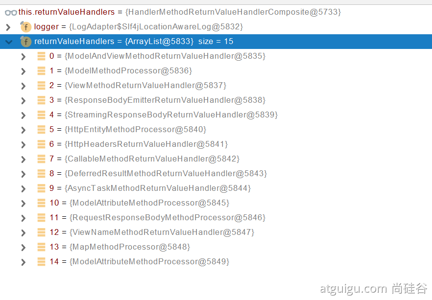

在的RequestMappingHandlerAdapter的invokeHandlerMethod中，添加返回值解析器5

```text
    //添加参数解析器
    if (this.argumentResolvers != null) {
        invocableMethod.setHandlerMethodArgumentResolvers(this.argumentResolvers);
    }
    //添加返回值解析器
    if (this.returnValueHandlers != null) {
        invocableMethod.setHandlerMethodReturnValueHandlers(this.returnValueHandlers);
    }
```


在ServletInvocableHandlerMethod的invokeAndHandle，先进行请求处理方法invokeForRequest，
请求处理完后面就是响应处理

```text
 public void invokeAndHandle(ServletWebRequest webRequest, ModelAndViewContainer mavContainer, Object... providedArgs) throws Exception {
        //请求处理
        Object returnValue = this.invokeForRequest(webRequest, mavContainer, providedArgs);
        //下面是处理响应返回的代码
        //设置响应状态
        this.setResponseStatus(webRequest);
        //如果对应controller的返回值是空或者void，就不做处理
        if (returnValue == null) {
            if (this.isRequestNotModified(webRequest) || this.getResponseStatus() != null || mavContainer.isRequestHandled()) {
                this.disableContentCachingIfNecessary(webRequest);
                mavContainer.setRequestHandled(true);
                return;
            }
        } else if (StringUtils.hasText(this.getResponseStatusReason())) {
            mavContainer.setRequestHandled(true);
            return;
        }

        mavContainer.setRequestHandled(false);
        Assert.state(this.returnValueHandlers != null, "No return value handlers");

        try {
            //具体处理返回值
            this.returnValueHandlers.handleReturnValue(returnValue, this.getReturnValueType(returnValue), mavContainer, webRequest);
        } catch (Exception var6) {
            if (this.logger.isTraceEnabled()) {
                this.logger.trace(this.formatErrorForReturnValue(returnValue), var6);
            }

            throw var6;
        }
    }
```

挑选返回值处理器以及具体返回值处理器怎么进行消息转换的原理如下

1. 返回值处理器判断是否支持这种类型返回值supportsReturnType
2. 返回值处理器调用handleReturnValue进行处理
   假设以@ResponseBody的返回值处理器RequestResponseBodyMethodProcessor进行分析：
   注意：ResponseBody并不是表是表示返回的就是json格式，RequestResponseBodyMethodProcessor中有很多
   MessageConverters其中有处理json的MessageConverters
3. RequestResponseBodyMethodProcessor可以处理返回值标了@ResponseBody 注解的。
4. 内容协商（浏览器默认会以请求头的方式告诉服务器他能接受什么样的内容类型，就是会在Request对象中的header中Accept字段指明浏览器能处理说明数据）
5. 根据浏览器的能处理的数据类型，服务器最终根据自己自身的能力，决定服务器能生产出什么样内容类型的数据。
6. RequestResponseBodyMethodProcessor会挨个遍历所有容器底层的HttpMessageConverter，看谁能处理
   如果得到的是处理json的converter，会进行如下面的步骤
7. 得到MappingJackson2HttpMessageConverter可以将对象写为json
8. 利用MappingJackson2HttpMessageConverter将对象转为json再写出去。
   **注意：处理器和converter不是一个东西**

SpringMVC支持的返回值如下（支持返回值种类对应返回值解析器的种类）

```text
    ModelAndView
    Model
    View
    ResponseEntity 
    ResponseBodyEmitter
    StreamingResponseBody
    HttpEntity
    HttpHeaders
    Callable
    DeferredResult
    ListenableFuture
    CompletionStage
    WebAsyncTask
    有@ModelAttribute注解，且返回值为对象类型的
    @ResponseBody注解（将所有对象都转换为json字符串）
```

注意：假如一个返回值有多个返回值解析器可支持，那么会用第一个支持的解析器进行处理，参数解析器也是一样。

# 响应Json

步骤如下

1. 引入转换JSON的jar包（SpringBoot默认引入了jackson）
2. 标注@RestController或者@ResponseBody（返回值不是一个视图，具体处理返回是不是json还要看对应的converter是哪个）
3. 确保在header中的accept属性值，json的权重比其他格式更高
   如下q代表权重因子，image/avif,image/webp,image/apng,*/*;q=0.8，中的*/*表示接受所有格式，故隐含了application/json

```text
Accept: text/html,application/xhtml+xml,application/xml;q=0.9,image/avif,image/webp,image/apng,*/*;q=0.8,application/signed-exchange;v=b3;q=0.9
```

补充：如果返回的xml在response对象中的content-type会显示Content-Type:application/json

# 响应xml

1. 引入jar

```xml

<dependency>
    <groupId>com.fasterxml.jackson.dataformat</groupId>
    <artifactId>jackson-dataformat-xml</artifactId>
</dependency>
```

2. 标注@RestController或者@ResponseBody
3. 确保accept中有application/xml，且权重正确
   补充：如果返回的xml在response对象中的content-type会显示Content-Type: application/xhtml+xml

# 不基于Header中的Accept的方法

1. 修改配置开启基于参数的内容协商

```yaml
    spring:
      contentnegotiation:
        favor-parameter: true  #开启请求参数内容协商模式
```

2. 发送请求时指定返回格式
   如下：format=json或者format=xml
   http://localhost:8080/test/person?format=json
   http://localhost:8080/test/person?format=xml
   **注意：这种基于请求参数的内容协商优先级高于Accept字段**

# 自定义MessageConverter

大致原理

1. 标注了@ResponseBody注解的方法，在响应时会调用RequestResponseBodyMethodProcessor进行处理
2. RequestResponseBodyMethodProcessor通过找MessageConverter进行处理
3. 添加自定义Converter如下

```text
    @Bean
    public WebMvcConfigurer webMvcConfigurer(){
        return new WebMvcConfigurer() {

            @Override
            public void extendMessageConverters(List<HttpMessageConverter<?>> converters) {
                converters.add(new CustomConverter());
            }
        }
    }
```

```java
class CustomConverter implements HttpMessageConverter<CalResult> {

    //该处理器能不能支持参数解析处理（这个不确定是不是）
    @Override
    public boolean canRead(Class<?> aClass, MediaType mediaType) {
        return false;
    }

    //就是该处理器能不能进行返回值处理
    @Override
    public boolean canWrite(Class<?> aClass, MediaType mediaType) {
        //这里设置如果是CalResult就支持
        return aClass.isAssignableFrom(CalResult.class);
    }

    //设置该converter能支持的协议类型
    @Override
    public List<MediaType> getSupportedMediaTypes() {
        //设置一个自定义协议类型
        return MediaType.parseMediaTypes(Collections.singletonList("application/cal"));
    }

    //读方法怎么做
    @Override
    public CalResult read(Class<? extends CalResult> aClass, HttpInputMessage httpInputMessage) throws IOException, HttpMessageNotReadableException {
        return null;
    }

    //写方法怎么做
    @Override
    public void write(CalResult calResult, MediaType mediaType, HttpOutputMessage httpOutputMessage) throws IOException, HttpMessageNotWritableException {
        //设置返回一个toString字符串
        String s = calResult.toString();
        //写出
        httpOutputMessage.getBody().write(s.getBytes());
    }
}
```

注意：自定义的converter，默认情况下不支持format=cal的写法
因为默认情况下，系统只添加了xml和json的映射，所以如果需要用format则需要自己重写策略

```text
   @Bean
   public WebMvcConfigurer webMvcConfigurer(){
         return new WebMvcConfigurer(){
               @Override
               public void configureContentNegotiation(ContentNegotiationConfigurer configurer){
                 HashMap<String, MediaType> mediaTypes=new HashMap<>();
                 //原本支持的两个策略，如果不写，那么这两个原本支持的就不支持了
                 mediaTypes.put("json",MediaType.APPLICATION_JSON);
                 mediaTypes.put("xml",MediaType.APPLICATION_XML);
                 //添加自己的策略
                 mediaTypes.put("cal",MediaType.parseMediaType("application/cal"));
                 ParameterContentNegotiationStrategy parameterContentNegotiationStrategy
                 =new ParameterContentNegotiationStrategy(mediaTypes);
                 configurer.strategies(Arrays.asList(parameterContentNegotiationStrategy));
               }
   }
```
注意：基于上面的修改后出现，出现一个bug。就是不用format的参数时，基于请求头的accept里面的属性也不生效了，
会默认使用呢添加的一个策略进行解析，上面代码的第一个添加策略是json。
解决方法就是补充基于请求头的策略
```text
            public void configureContentNegotiation(ContentNegotiationConfigurer configurer) {
                HashMap<String, MediaType> mediaTypes = new HashMap<>();
                mediaTypes.put("json", MediaType.APPLICATION_JSON);
                mediaTypes.put("xml", MediaType.APPLICATION_XML);
                //添加自己的
                mediaTypes.put("cal", MediaType.parseMediaType("application/cal"));
                ParameterContentNegotiationStrategy parameterContentNegotiationStrategy
                        = new ParameterContentNegotiationStrategy(mediaTypes);
                //加基于请求头的       
                HeaderContentNegotiationStrategy headerContentNegotiationStrategy 
                        = new HeaderContentNegotiationStrategy();
                configurer.strategies(Arrays.asList(parameterContentNegotiationStrategy,headerContentNegotiationStrategy));
            }
```

补充：如果需要自定义协议转换参数，如不叫format
```text
         public void configureContentNegotiation(ContentNegotiationConfigurer configurer) {
                ....
                ParameterContentNegotiationStrategy parameterContentNegotiationStrategy
                        = new ParameterContentNegotiationStrategy(mediaTypes);
                //自定义一个叫application-type替换format
                parameterContentNegotiationStrategy.setParameterName("application-type");
                ....
         }
```