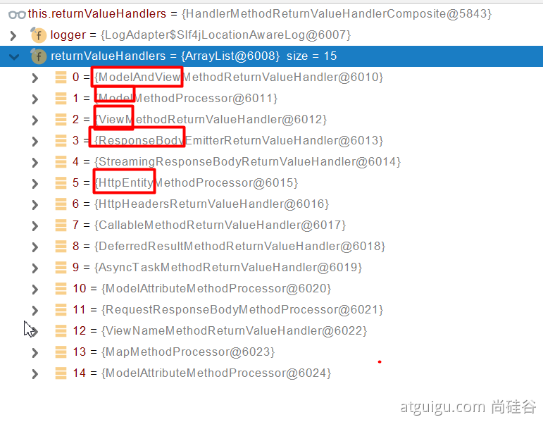
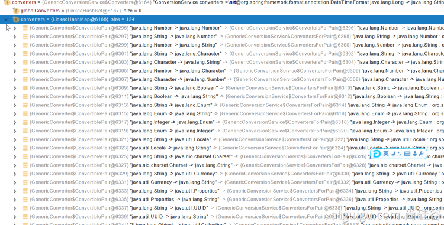

# URL隐射到具体方法与注入参数原理
请求映射的类关系主要涉及四个类
HttpServlet<-HttpServletBean<-FrameworkServlet<-DispatcherServlet(右边继承左边)
假设以一个get请求为例:
调用过程是:doGet(HttpServlet定义的方法,FrameworkServlet中实现)->doService(FrameworkServlet的实现)>doDispatch(DispatcherServlet的实现)
最核心的方法是DispatcherServlet中的doDispatch,所有URL请求都会调用此方法进行路由映射
```text
protected void doDispatch(HttpServletRequest request, HttpServletResponse response) throws Exception {}
```
1. 找能处理的handler
doDispatch根据下面的代码查找该Request的URL信息,是否有对应能处理的handler(也就是对应controller中隐射到的方法)
```text
 mappedHandler = this.getHandler(processedRequest);
 if (mappedHandler == null) {
     this.noHandlerFound(processedRequest, response);
     return;
 }
```
2. 执行:前钩子->handler->后钩子
handler就是封装了对应处理方法的反射信息
```text
      //获得handler对应的HandlerAdapter
      HandlerAdapter ha = this.getHandlerAdapter(mappedHandler.getHandler());
      //前钩子
      if (!mappedHandler.applyPreHandle(processedRequest, response)) {
          return;
      }
      //调用HandlerAdapter的handler()其实就是反射执行对应映射到的方法了，不过在真正执行前会做一些工作，比如参数解析...
      //handler里面的具体调用涉及了参数解析
      mv = ha.handle(processedRequest, response, mappedHandler.getHandler());
      if (asyncManager.isConcurrentHandlingStarted()) {
          return;
      }
      //后钩子
      this.applyDefaultViewName(processedRequest, mv);
      mappedHandler.applyPostHandle(processedRequest, response, mv);
```
3. 参数解析
在handler()方法调用链路中，会进入到RequestMappingHandlerAdapter中的invokeHandlerMethod()方法
该方法中，有一段给adapter设置参数解析器，springmvc支持什么参数解析的功能都在参数解析器中
```text
 if (this.argumentResolvers != null) {
                invocableMethod.setHandlerMethodArgumentResolvers(this.argumentResolvers);
 }
```
如支持@RequestParm注解，下面的参数解析器中就有对应的解析器对象，如下图的索引0处

补充：
在上面的方法下方，还设置了返回值处理器
```text
    if (this.argumentResolvers != null) {
        invocableMethod.setHandlerMethodArgumentResolvers(this.argumentResolvers);
    }
    //设置返回值处理器
    if (this.returnValueHandlers != null) {
        invocableMethod.setHandlerMethodReturnValueHandlers(this.returnValueHandlers);
    }
```
返回值处理器，比如你打了@ResponseBody，按理就有响应的返回值处理器，如下索引3出就是处理@ResponseBody的返回值处理器


在handler方法执行链路中执行到getMethodArgumentValues方法就是具体解析参数了

# 参数映射注解
## @PathVariable
路径变量用法很简单结合URL即可,如果下面既可以获得id
```text
    @GetMapping("/test/{id}")
    public String test(@PathVariable("id") Integer id,//某个
      @PathVariable Map<String,String> pv //全部
    )
```
## @RequestParam
获取url中?或者body中的KV参数
```text
    假设请求是/test?id=1
    @GetMapping("/test")
    public String test(@RequestParam("age") Integer id
     @RequestParam Map<String,String> params
    )
```
## @CookieValue
获取cookie中的KV参数和@RequestParam用法类似
```text
    @GetMapping("/test")
    public String test(@CookieValue("_ga") String _ga
     @CookieValue("_ga") Cookie cookie//返回cookie对象
     //应该也支持全部写法
    )
```
## @RequestHeader
获取HEADER中的KV参数
```text
    @GetMapping("/test")
    public String test(@RequestHeader("User-Agent") String userAgent,//获取某个值
                       @RequestHeader Map<String,String> header //获取全部)
```
## @RequestBody
获得POST请求中的body数据
```text
    @GetMapping("/test")
    public String test(@RequestBody String content)
```
注意：如果对方发的是一个json数据域，如果要把该数据映射到一个javaBean中，
那么这个参数对象一定要打上@RequestBody注解，否则映射不到

## @MatrixVariable
矩阵请求写法
```text
    //1、语法： 请求路径：/cars/sell;low=34;brand=byd,audi,yd
    
    //2、SpringBoot默认是禁用了矩阵变量的功能
    // 手动开启：原理。对于路径的处理。UrlPathHelper进行解析。removeSemicolonContent（移除分号内容）支持矩阵变量的
    
    //测试
    //3、矩阵变量必须有url路径变量才能被解析
    @GetMapping("/cars/{path}")
    public Map carsSell(@MatrixVariable("low") Integer low,
                        @MatrixVariable("brand") List<String> brand,
                        @PathVariable("path") String path){
        Map<String,Object> map = new HashMap<>();

        map.put("low",low);
        map.put("brand",brand);
        map.put("path",path);
        return map;
    }
    //可以设置不同路变量路径下的附带变量，如下设置两个age
    // url：/boss/1;age=20/2;age=10
    @GetMapping("/boss/{bossId}/{empId}")
    public Map boss(@MatrixVariable(value = "age",pathVar = "bossId") Integer bossAge,
                    @MatrixVariable(value = "age",pathVar = "empId") Integer empAge){
        Map<String,Object> map = new HashMap<>();

        map.put("bossAge",bossAge);
        map.put("empAge",empAge);
        return map;

    }

}
```
## @ModelAttribute


# 特殊对象参数
## ServletApi对象
常见的有：Request、Response、Session、Cookie
主要看HandlerMethodArgumentResolver他的实现类中
public boolean supportsParameter(MethodParameter parameter) {}
方法是怎么写的，比如在上面提到的argumentResolvers中有ServletRequestMethodArgumentResolver这个实现类
他是负责映射Request对象的，他的supportsParameter方法中说明了支持隐射的Request对象
```text
    public boolean supportsParameter(MethodParameter parameter) {
        Class<?> paramType = parameter.getParameterType();
        return WebRequest.class.isAssignableFrom(paramType) 
        || ServletRequest.class.isAssignableFrom(paramType) 
        || MultipartRequest.class.isAssignableFrom(paramType) 
        || HttpSession.class.isAssignableFrom(paramType) 
        || pushBuilder != null && pushBuilder.isAssignableFrom(paramType) 
        || Principal.class.isAssignableFrom(paramType) 
        || InputStream.class.isAssignableFrom(paramType) 
        || Reader.class.isAssignableFrom(paramType) 
        || HttpMethod.class == paramType 
        || Locale.class == paramType 
        || TimeZone.class == paramType 
        || ZoneId.class == paramType;
    }
```

## Spring支持的一些特殊对象
1. Model（或ModelAndView）、Map<String,Object>、Request的关系
假设某个方法注入了这三个对象，最后重定向到某个接口
```text
 方法(Model,Map<String,Object>,HttpServletRequest request){
 
    return "redirect:/xx"
 }
```
Model和Map底层数据是共享的，即Model内部封装了一个Map对象，而Map<String,Object>引用了Model的map
所以给操作Model和Map增减数据是一样的。而启用重定向解析后，SpringMVC会被Model中的数据放到Request对象中
相当于调用Request.setAttribute()
注意：ModelAndView相当于Model+View，所以包含了Model拥有相同特性
2. RedirectAttributes（ 重定向携带数据）

## 自定义的pojo
主要关注的内部对象封装
如下举例的内部对象Pet被封装的写法
Pojo涉及的参数封装处理器是ServletModelAttributeMethodProcessor
```text
    /**
     *     姓名： <input name="userName"/> <br/>
     *     年龄： <input name="age"/> <br/>
     *     生日： <input name="birth"/> <br/>
     *     宠物姓名：<input name="pet.name"/><br/>
     *     宠物年龄：<input name="pet.age"/>
     */
    @Data
    public class Person {
        
        private String userName;
        private Integer age;
        private Date birth;
        private Pet pet;
        
    }
    
    @Data
    public class Pet {
    
        private String name;
        private String age;
    
    }
```
原理如下：
1. 参数解析时先判断该参数是否是简单类型（如自定义pojo就不认为是简单参数）
注意：该方法在ServletModelAttributeMethodProcessor的父类
```text
 public boolean supportsParameter(MethodParameter parameter) {
        return parameter.hasParameterAnnotation(ModelAttribute.class) 
        || this.annotationNotRequired 
        && !BeanUtils.isSimpleProperty(parameter.getParameterType());
    }
```
2. 进行转换调用resolveArgument，该方法也在父类
该方法核心转换步骤如下
```text
            /*
            创建一个WebDataBinder的实例，binder中有一个属性target，这个target就是要创建pojo的实例
            */
            WebDataBinder binder = binderFactory.createBinder(webRequest, attribute, name);
            if (binder.getTarget() != null) {
                if (!mavContainer.isBindingDisabled(name)) {
                    //WebDataBinder有属性叫conversionService这个属性里面有很多converters
                    //通过调用converters将参数绑定到target中（也就是pojo）里面
                    this.bindRequestParameters(binder, webRequest);
                }

                this.validateIfApplicable(binder, parameter);
                if (binder.getBindingResult().hasErrors() && this.isBindExceptionRequired(binder, parameter)) {
                    throw new BindException(binder.getBindingResult());
                }
            }

            if (!parameter.getParameterType().isInstance(attribute)) {
                attribute = binder.convertIfNecessary(binder.getTarget(), parameter.getParameterType(), parameter);
            }

            bindingResult = binder.getBindingResult();
```


可以给WebDataBinder里面放自己的Converter
如下一个字符串转数字的Converter
private static final class StringToNumber<T extends Number> implements Converter<String, T>
自定义Converter方法如下
```text
@FunctionalInterface
public interface Converter<S, T> {
    @Nullable
    T convert(S var1);
}
```
注意：不建议使用lambda写法，容易出现泛型问题，用匿名内部类写法
假如请求的URL=/cal?arg=3*3,要把算数3*3转换成结果9，放到一个算数结果CalResult对象中。
```text
     public WebMvcConfigurer webMvcConfigurer() {
        return new WebMvcConfigurer() {
            @Override
            public void addFormatters(FormatterRegistry registry) {
                registry.addConverter(
                        new Converter<String, CalResult>() {
                            @Override
                            public CalResult convert(String s) {
                                String[] split = s.split("\\*");
                                return new CalResult(
                                        Integer.parseInt(split[0]),
                                        Integer.parseInt(split[1]),
                                        Integer.parseInt(split[0]) * Integer.parseInt(split[1])
                                );
                            }
                        }
                );
            }
        };
    }
```
注意：需要注意S->T会不会和原有Converter冲突，如String->Number
```text
 @GetMapping(value = "/cal")
    @ResponseBody
    public CalResult cal(@RequestParam("arg") CalResult calResult) {
        System.out.println(calResult);
        return calResult;
    }
```
注意：@RequestParam("arg")需要指定