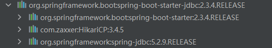

# 导入相关依赖
[找starter](https://docs.spring.io/spring-boot/docs/2.3.4.RELEASE/reference/html/using-spring-boot.html#using-boot-starter)
添加jdbc的starter
```xml
        <dependency>
            <groupId>org.springframework.boot</groupId>
            <artifactId>spring-boot-starter-jdbc</artifactId>
        </dependency>
```

由图可以看出，spring-jdbc只导入了数据连接池和spring对jdbc支持的相关依赖，
并没有导入具体的数据库连接类，如mysql的connect，因为jdbc可以连接mysql或者别的数据库，具体不确定。
因此如果要使用mysql需要自己再添加数据库连接驱动
```xml
<dependency>
    <groupId>mysql</groupId>
    <artifactId>mysql-connector-java</artifactId>
</dependency>
```
注意：在spring-boot-dependencies的pom.xml里已经定义了mysql的版本信息， 所以不需要自己写版本
但是如果官方默认指定的版本过高，需要自己指定低版本驱动。

# 配置数据库
如配置mysql数据库
```yaml
spring: 
  datasource:
    url: jdbc:mysql://192.168.0.44:3306/dbCloud?useUnicode=true&characterEncoding=utf-8&useSSL=true
    password: 123456
    username: root
    driver-class-name: com.mysql.cj.jdbc.Driver
```
注意：连接池默认选用的是harika，如果需要修改连接池，也可以在spring.datasource中修改type属性

# 使用jdbcTemplate
通过注入jdbcTemplate，然后就可以使用jdbcTemplate对数据库进行操作

# 使用第三方数据源，如druid数据库连接池
## 手动导入方法
导入druid依赖
```xml
  <dependency>
            <groupId>com.alibaba</groupId>
            <artifactId>druid</artifactId>
            <version>1.1.17</version>
  </dependency>
```
配置DataSource类
注意：@ConditionalOnMissingBean(DataSource.class)这个条件表示了实例化Hikari不能有DataSource.class这个类
```text
    @Configuration(proxyBeanMethods = false)
	@ConditionalOnClass(HikariDataSource.class)
	@ConditionalOnMissingBean(DataSource.class)
	@ConditionalOnProperty(name = "spring.datasource.type", havingValue = "com.zaxxer.hikari.HikariDataSource",
			matchIfMissing = true)
	static class Hikari {
	
	}
```
2.
## 使用druid-starter方法
```xml
        <dependency>
            <groupId>com.alibaba</groupId>
            <artifactId>druid-spring-boot-starter</artifactId>
            <version>1.1.17</version>
        </dependency>
```
相关可配置内容
```text
● 扩展配置项 spring.datasource.druid
● DruidSpringAopConfiguration.class,   监控SpringBean的；配置项：spring.datasource.druid.aop-patterns
● DruidStatViewServletConfiguration.class, 监控页的配置：spring.datasource.druid.stat-view-servlet；默认开启
● DruidWebStatFilterConfiguration.class, web监控配置；spring.datasource.druid.web-stat-filter；默认开启
● DruidFilterConfiguration.class}) 所有Druid自己filter的配置
```
[druid配置文档](https://github.com/alibaba/druid/wiki/DruidDataSource%E9%85%8D%E7%BD%AE%E5%B1%9E%E6%80%A7%E5%88%97%E8%A1%A8)

# 自动配置分析
1. DataSourceAutoConfiguration 数据源自动配置类
```text
@Configuration(
    proxyBeanMethods = false
)
@ConditionalOnClass({DataSource.class, EmbeddedDatabaseType.class})
@ConditionalOnMissingBean(
    type = {"io.r2dbc.spi.ConnectionFactory"}
)
@EnableConfigurationProperties({DataSourceProperties.class})
@Import({DataSourcePoolMetadataProvidersConfiguration.class, DataSourceInitializationConfiguration.class})
public class DataSourceAutoConfiguration {

}
```
注意：@EnableConfigurationProperties({DataSourceProperties.class})
该类指定了相关配置信息的前缀，可以在properties中进行修改
```text
@ConfigurationProperties(
    prefix = "spring.datasource"
)
public class DataSourceProperties implements BeanClassLoaderAware, InitializingBean {
```

2. DataSourceTransactionManagerAutoConfiguration 数据源事务自动配置类
```text
@Configuration(
    proxyBeanMethods = false
)
@ConditionalOnClass({JdbcTemplate.class, PlatformTransactionManager.class})
@AutoConfigureOrder(Integer.MAX_VALUE)
@EnableConfigurationProperties({DataSourceProperties.class})
public class DataSourceTransactionManagerAutoConfiguration {

}
```

3. JdbcTemplateAutoConfiguration JdbcTemplate的自动配置，类似MyBatis的ORM框架类
```text
@Configuration(
    proxyBeanMethods = false
)
@ConditionalOnClass({DataSource.class, JdbcTemplate.class})
@ConditionalOnSingleCandidate(DataSource.class)
@AutoConfigureAfter({DataSourceAutoConfiguration.class})
@EnableConfigurationProperties({JdbcProperties.class})
@Import({JdbcTemplateConfiguration.class, NamedParameterJdbcTemplateConfiguration.class})
public class JdbcTemplateAutoConfiguration {

}
```