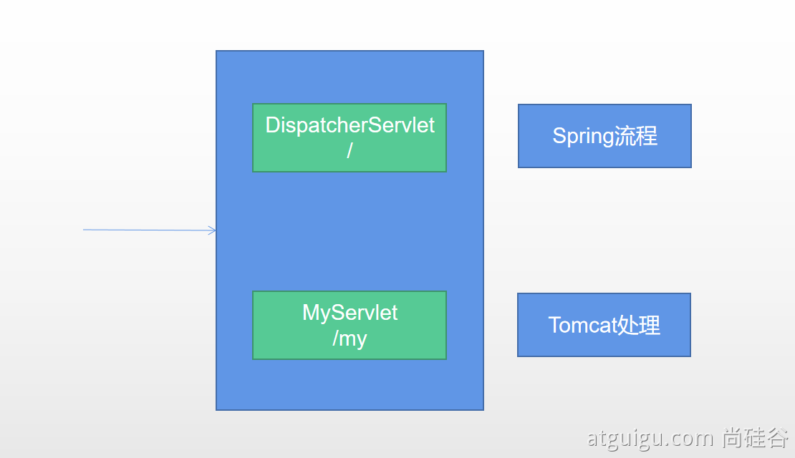

# Servlet分类
servlet的组件分别分为：Servlet、Filter、Listener
在SpringBoot应用中，可将Servlet分为原生Servlet和DispatcherServlet，DispatcherServlet（spring的servlet类）
调用原生Servlet与调用DispatcherServlet有一定区别


# 方式一：使用Servlet注解+@ServletComponentScan
如自定义一个Servlet
* 实现一个Servlet类
```text
@WebServlet(urlPatterns = "/servlet")//指定映射url路径
public class MyServlet extends HttpServlet {

    @Override
    protected void doGet(HttpServletRequest req, HttpServletResponse resp) throws ServletException, IOException {
        resp.getWriter().write("<h1>response</h1>");
    }
}
```
* 在SpringBoot启动类上添加ServletComponentScan注解
```text
@SpringBootApplication
@ServletComponentScan("sj.springboot.learn.servlet")//指定自定义servlet类的包路径，使自定义servlet生效
```
注意：
1. 实现的Servlet的类要添加上相关注解，如@WebServlet(urlPatterns = "/servlet")

# 方式二：使用RegistrationBean
如下分别自定义了Servlet、Filter、Listener
```text
@Configuration
public class MyRegistration {

    class Servlet extends HttpServlet {
        @Override
        protected void doGet(HttpServletRequest req, HttpServletResponse resp) throws ServletException, IOException {
            resp.getWriter().write("servlet2");
        }
    }
    //实现Servlet
    @Bean
    public ServletRegistrationBean myServlet() {
        return new ServletRegistrationBean(new Servlet(), "/servlet2");
    }

    //实现Filter
    @Bean
    public FilterRegistrationBean myFilter() {
        FilterRegistrationBean<Filter> filterFilterRegistrationBean
                = new FilterRegistrationBean<>((req, resp, fc) -> {
            resp.getWriter().write("filter2");
        });
        filterFilterRegistrationBean.setUrlPatterns(Collections.singleton("/filter2/*"));
        return filterFilterRegistrationBean;
    }
    class Listener implements ServletContextListener{
        @Override
        public void contextInitialized(ServletContextEvent sce) {
            ServletContextListener.super.contextInitialized(sce);
        }

        @Override
        public void contextDestroyed(ServletContextEvent sce) {
            ServletContextListener.super.contextDestroyed(sce);
        }
    }
    //实现Listener
    @Bean
    public ServletListenerRegistrationBean myListener(){
      
        return new ServletListenerRegistrationBean(new Listener());
    }
}
```