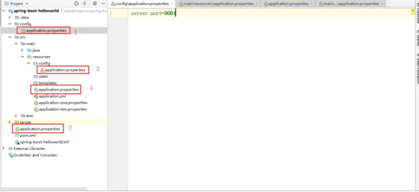

# application.yml/properties作用范围
## 两种文件的优先级
对于 application.properties 和 application.yml来说，他们之间的配置内容如果不冲突的话是可以互补使用的，
但是如果他们之间的配置冲突的话，项目会优先读取 application.properties中的配置，
所以application.properties的优先级大于application.yml的优先级，
所有application.properties会覆盖application.yml中相同的配置。
## 存放位置关系
针对同一个文件，放在不同的文件目录下，他们的优先级也是不一样的。
Spring Boot启动会扫描以下位置的application.properties或者application.yml文件作为Spring Boot 的默认配置文件
①: - file(项目文件):./config/
②: - file(项目文件):./
③: - classpath(resources类路径):/config/
④: - classpath(resources类路径):/

优先级按①②③④从高到低的顺序,所有位置的文件都会被加载,高优先级配置内容会覆盖低优先级配置的内容;
Spring Boot会从这四个位置全部加载主配置文件形成:互补配置
也可以通过配置spring.config.location=url配置文件路径指令来改变默认的配置文件位置;
项目打包以后,可以用使用命令行参数的形式,启动项目的时候来指定配置文件的新位置,指定的配置文件和默认加载的配置文件会共同起作用,形成互补配置;

注意：①和②相当于和打包好的jar包在同一个层级，③和④相当于配置在jar包里面

# Profile功能
SpringBoot默认加载application.yaml/properties
但是如果如果有多套配置方案可以用Profile功能
假设有如下两个文件
application.yaml
application-{xx}.yaml
xx文件默认情况下是不生效的，但是可以通过以下两种任意一种使生效
* yaml或properties中指定生效
spring.profiles.active=xx
* 命令行指定
java -jar xxx.jar --spring.profiles.active=xx  
**注意：
1. profile生效后，优先级大于properties/yml** 
2. 命令行的优先级，大于yaml或properties，即使在文件中指定了spring.profiles.active
命令行也能覆盖
3. **命令行能些多个参数，除了能写--spring.profiles.active，也能写别的配置，甚至还能写person.age这种自定义属性
可以把命令行认为是一个优先级最高的配置文件**

# profile分组功能
在配置文件中写spring.profiles.group.xx[?],就是进行分组
如下定义了一个production分组，该分组有两个元素。
spring.profiles.group.production[0]=proddb
spring.profiles.group.production[1]=prodmq
当让spring.profiles.active=production时，该组下对应的两个配置文件都会生效

# Profile注解
假设两个component分别打上了@Profile注解，只有spring.profiles.active
指定了对应的值，对应的类才会生效。profile除了能标在类上还能标在方法上
```text
@Profile("test")
@Configuration
class A{

}

@Profile("work")
@Configuration
class B{

}
```
```text
@Configuration
class Config{

    @Profile("test")
    @Bean
    public A(){
    
    }
    
    @Profile("work")
    @Bean
    public B(){
    
    }
}

```