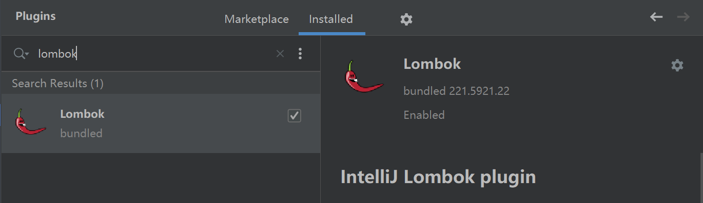
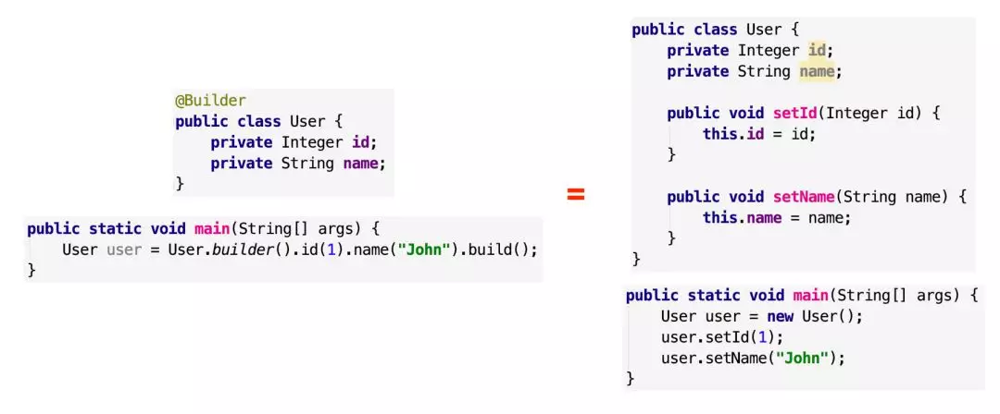

1. 把项目打成可执行Jar包
* 引入打包插件到Pom.xml
```xml
    <build>
        <plugins>
            <plugin>
                <groupId>org.springframework.boot</groupId>
                <artifactId>spring-boot-maven-plugin</artifactId>
            </plugin>
        </plugins>
    </build>
```
* 使用Maven的package功能

2. 使用Lombok简化JavaBean的代码
注意：SpringBoot在parent中已经指定了Version
```xml
<dependency>
            <groupId>org.projectlombok</groupId>
            <artifactId>lombok</artifactId>
</dependency>
```
在Idea市场安装号Lombok插件

在JavaBean中实践
```java
    @Data //使用@Data注解会帮助JavaBean生成get、set方法
    @ToString //使用@ToString会帮助生成toString方法
    @AllArgsConstructor//生成一个使用所有参数的构造器
    @NoArgsConstructor//生成一个无参数构造器
    @Slf4j //自动注入log4j属性
    public class LombokBean {
        private String name;
    
        public static void main(String[] args) {
            //使用自动注入的log4j
            log.info("hello");
        }
    }
```
补充：还有一个构造参数的注解
@Builder:自动生成流式 set 值写法，从此之后再也不用写一堆 setter 了

@RequiredArgsConstructor//生成带有必需参数的构造函数。 必需的参数是最终字段和具有约束的字段，例如@NonNull 。
@Getter与@Setter相当于@Data的组合
@Value=@Getter与+@ToString+@EqualsAndHashCode+@RequiredArgsConstructor
@EqualsAndHashCode
自动生成 equals(Object other) 和 hashcode() 方法，包括所有非静态变量和非 transient 的变量
生成的equals方法源码：比较是不是同一个对象、比较是不是同一个实例、最后比较属性值是否相等
* 注 如果某些变量不想要加进判断，可以透过 exclude 排除，也可以使用 of 指定某些字段
如：@EqualsAndHashCode(exclude={“属性名”}),@EqualsAndHashCode(of={“属性名”})
```text
 public boolean equals(final Object o) {
        if (o == this) {//同一个对象
            return true;
        } else if (!(o instanceof LombokBean)) { //是不是该实例
            return false;
        } else {
            LombokBean other = (LombokBean)o; 
            if (!other.canEqual(this)) { //对方是不是同实例
                return false;
            } else { //比较属性值
                Object this$name = this.getName();
                Object other$name = other.getName();
                if (this$name == null) {
                    if (other$name != null) {
                        return false;
                    }
                } else if (!this$name.equals(other$name)) {
                    return false;
                }

                Object this$msg = this.getMsg();
                Object other$msg = other.getMsg();
                if (this$msg == null) {
                    if (other$msg != null) {
                        return false;
                    }
                } else if (!this$msg.equals(other$msg)) {
                    return false;
                }

                return true;
            }
        }
    }
```

3. devTools
```xml
        <dependency>
            <groupId>org.springframework.boot</groupId>
            <artifactId>spring-boot-devtools</artifactId>
            <optional>true</optional>
        </dependency>
```
加入依赖后，每次修改项目后按ctrl+F9可以实现热更新
注意：这里的热更新本质是假热更新，如果要实现真的热更新需要用jrebel
 